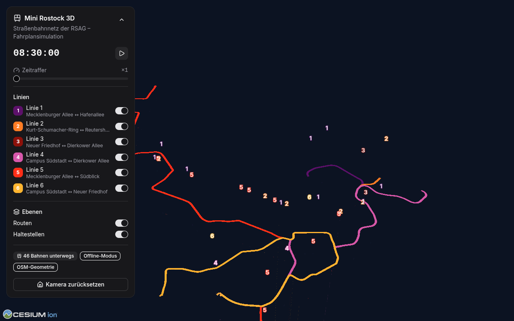

# 🚋 Mini Rostock 3D

**Der Rostocker Straßenbahnverkehr live auf einer photorealistischen 3D-Karte** – inspiriert von
[mini-tokyo-3d](https://github.com/nagix/mini-tokyo-3d), gebaut mit
[CesiumJS](https://cesium.com/platform/cesiumjs/) und
[Google Photorealistic 3D Tiles](https://cesium.com/learn/cesiumjs-learn/cesiumjs-photorealistic-3d-tiles/).

Die Straßenbahnen der RSAG (Linien 1, 2, 3, 5, 6) fahren fahrplanbasiert über ihre realen
Routen durch die Stadt – mit Zeitraffer, Linienfiltern, Haltestellen-Layer und einer
an [shadcn/ui](https://ui.shadcn.com/) angelehnten Oberfläche.



> Der Screenshot stammt aus dem netzwerklosen **Offline-Modus** der Testumgebung
> (`?offline=1`, Gitter statt Fototextur). Mit Internetzugang rendert die App die
> photorealistischen Google-3D-Kacheln von Rostock.

---

## Milestone 1 – Status

| # | Anforderung | Status |
|---|-------------|--------|
| 1 | Cesium-Karte mit Google 3D Tiles | ✅ `createGooglePhotorealistic3DTileset` via Cesium ion, Fallback auf Gitter-Globus wenn nicht erreichbar |
| 2 | Straßenbahnen als einfache Quader auf realen Routen | ✅ 3D-Boxen (32 m × 2,65 m × 3,6 m) mit Linien-Label, fahrplanbasierte Simulation (siehe [Datenlage](#datenlage--gtfs--gtfs-realtime--osm)) |
| 3 | Routen/Linien auf der Karte | ✅ Auf Boden/3D-Kacheln drapierte Polylinien in Linienfarben + Haltestellen-Layer |
| 4 | Interface mit shadcn(-angelehnt) | ✅ Tailwind v4 + Radix-Primitives, shadcn-Komponentenstil (Card, Button, Badge, Switch, Slider) |
| 5 | Visuelle und funktionale Tests | ✅ 44 Unit-Tests (Vitest), 8 funktionale + 3 visuelle E2E-Tests (Playwright) |

## Schnellstart

```bash
npm install        # kopiert auch die Cesium-Assets nach public/cesium (postinstall)
npm run dev        # → http://localhost:5173
```

**Cesium-Ion-Token:** Ein Standard-Token ist in `src/config.ts` hinterlegt und kann ohne
Codeänderung per `.env` überschrieben werden (siehe `.env.example`):

```bash
VITE_CESIUM_ION_TOKEN=dein-token
```

> Ion-Tokens sind clientseitige, veröffentlichbare Tokens – sie landen zwangsläufig im
> Browser-Bundle. Trotzdem empfiehlt es sich, den Token im
> [Cesium-ion-Dashboard](https://ion.cesium.com/tokens) auf die eigenen Domains
> einzuschränken. Für die Google-3D-Kacheln muss im ion-Konto der Zugriff auf
> *Google Photorealistic 3D Tiles* (Asset 2275207) aktiviert sein.

### Nützliche URL-Parameter

| Parameter | Wirkung |
|-----------|---------|
| `?offline=1` | Kein Ion/Google-Zugriff, Gitter-Globus (Basis der Tests) |
| `?speed=60` | Zeitraffer-Startwert (1–600) |
| `?time=08:30` | Simulationszeit setzen (Europe/Berlin) |
| `?paused=1` | Simulation eingefroren starten |

## Tests

```bash
npm test               # Unit-Tests (Vitest): Geodäsie, Fahrplan-Engine, Uhr, Netz-Validierung, UI
npm run test:e2e       # E2E + visuelle Regression (Playwright, komplett offline & deterministisch)
npm run test:e2e:update  # Visuelle Baselines neu erzeugen (nach gewollten UI-Änderungen)
```

Die E2E-Tests starten die echte App im Offline-Modus mit eingefrorener Simulationszeit
(08:30 Uhr) und rendern Cesium headless über SwiftShader – dadurch sind auch die
Screenshot-Vergleiche deterministisch. In CI (GitHub Actions) läuft beides automatisch,
siehe `.github/workflows/ci.yml`.

## Datenlage – GTFS / GTFS-Realtime / OSM

### Was die App aktuell nutzt

- **Routen & Haltestellen:** `src/data/network.json`. Der mitgelieferte Datensatz bildet
  das reale RSAG-Liniennetz ab (Linie 1 Mecklenburger Allee ↔ Hafenallee, Linie 2
  Reutershagen ↔ Kurt-Schumacher-Ring, Linie 3 Neuer Friedhof ↔ Kurt-Schumacher-Ring,
  Linie 5 Mecklenburger Allee ↔ Südblick, Linie 6 Neuer Friedhof ↔ Campus Südstadt),
  **die Geometrie ist jedoch handmodelliert/approximiert** – erkennbar am Badge
  „Demo-Daten (approximiert)“ in der App.
- **Fahrplan:** Ein synthetischer, RSAG-ähnlicher Takt (werktags ca. alle 10 Minuten,
  Betrieb ~4:30–24:00 Uhr) aus `src/lib/timetable.ts`. Die Bahnen fahren also wie bei
  mini-tokyo-3d **fahrplanbasiert**, nicht nach Echtzeitdaten.

### Echte Daten einspielen (empfohlen, benötigt freien Internetzugang)

```bash
npm run data:update    # Echte Gleisgeometrien + Haltestellen aus OpenStreetMap (Overpass API)
npm run data:gtfs      # Echte Abfahrtszeiten aus einem GTFS-Feed → src/data/schedule.json
npm test               # validiert die neuen Datensätze
```

- `data:update` überschreibt `network.json` mit den echten OSM-Tram-Relationen
  (© OpenStreetMap-Mitwirkende, [ODbL](https://www.openstreetmap.org/copyright)).
- `data:gtfs` lädt standardmäßig den freien Deutschland-Nahverkehrsfeed von
  [gtfs.de](https://gtfs.de) (DELFI-Basis). Mit `GTFS_URL`/`GTFS_FILE` kann stattdessen
  der offizielle VVW-Feed genutzt werden.
- Die Unit-Tests passen sich der Datenquelle an: Die strikten RSAG-Prüfungen laufen nur
  gegen den Demo-Datensatz, strukturelle Prüfungen (Monotonie, Stadtgebiet, Längen)
  gegen jeden Datensatz.

**Troubleshooting Datenpipeline**

| Problem | Lösung |
|---------|--------|
| Overpass antwortet mit 403/406/429 | Das Skript sendet einen User-Agent und probiert automatisch mehrere Mirror (overpass-api.de → kumi.systems → osm.ch). Eigenen Endpunkt per `OVERPASS_URL=… npm run data:update` setzen oder eine gespeicherte Antwort per `OVERPASS_FILE=antwort.json` einspielen. |
| GTFS-Download dauert lange | Der Feed (~260 MB) wird unter `scripts/.cache/gtfs.zip` gecacht; Datei löschen für einen frischen Download. Bereits vorhandene Zips via `GTFS_FILE=pfad.zip` nutzen. |
| CI/Sandbox ohne freien Internetzugang | Overpass/gtfs.de sind dort nicht erreichbar – der mitgelieferte Datensatz bleibt aktiv. |

### Ist GTFS-Realtime für Rostock verfügbar? (Stand: August 2026)

Kurzfassung: **Soll-Fahrplandaten ja, ein offener GTFS-Realtime-Feed nur mit Einschränkungen.**

- **VVW/RSAG (offiziell):** Der Verkehrsverbund Warnow stellt die
  [Soll-Fahrplandaten als GTFS](https://www.verkehrsverbund-warnow.de/service/open-data.html)
  über das Open-Data-Portal der Connect Fahrplanauskunft GmbH bereit
  (kostenlose Registrierung, Freigabe durch den VVW). Ein öffentlich dokumentierter
  GTFS-**Realtime**-Feed des VVW ist dort bislang nicht verfügbar.
- **Echtzeit existiert intern:** Die RSAG liefert minutengenaue Echtzeitdaten in die
  HAFAS-Auskunft (VVW-App, fahrplaner.de) – nur eben nicht als offenen GTFS-RT-Feed.
- **Deutschlandweite Alternativen:** [gtfs.de](https://gtfs.de/de/realtime/) bietet einen
  GTFS-RT-Feed (DELFI-basiert, in der freien Variante eingeschränkt), der zum
  gtfs.de-Soll-Feed passt und RSAG-Fahrten enthalten kann.
- **Vorbereitung in der App:** `.env` kennt bereits `VITE_GTFS_RT_URL`. Die Anbindung
  (Protobuf-Decoding, Trip-Matching, CORS-Proxy) ist Milestone 2 – die Simulation ist so
  gebaut, dass Echtzeitpositionen die fahrplanbasierten Positionen überlagern können.

## Architektur

```
src/
├── config.ts               # Token, Kamera-Startposition, Simulations-Parameter
├── data/
│   ├── network.json        # Liniennetz (generiert; Skripte s. u.)
│   ├── schedule.json       # optionale echte Abfahrtszeiten (GTFS)
│   └── network.ts          # Laden + Aufbereitung (Distanzen, Richtungs-Spiegelung)
├── lib/
│   ├── geo.ts              # Haversine, Bearing, Polylinien-Interpolation/-Projektion
│   ├── clock.ts            # Simulationsuhr (Zeitraffer, Pause, Europe/Berlin)
│   └── timetable.ts        # Taktfahrplan-Synthese + Fahrt-Zustände (dwell/moving)
├── engine/simulation.ts    # Uhr + Fahrplan → TramSnapshots pro Frame
├── map/CesiumMap.ts        # Viewer, Google 3D Tiles, Routen, Haltestellen, Tram-Boxen
├── components/             # shadcn-artige UI (ControlPanel, TramCard, ui/*)
└── App.tsx                 # Verdrahtung, Render-Loop, Test-API (window.__mrt)

scripts/
├── build-approx-network.mjs  # erzeugt den mitgelieferten Demo-Datensatz
├── fetch-osm-network.mjs     # echte Geometrie aus OSM/Overpass  (npm run data:update)
├── fetch-gtfs-schedule.mjs   # echte Abfahrtszeiten aus GTFS     (npm run data:gtfs)
└── copy-cesium-assets.mjs    # Cesium-Statik nach public/cesium  (postinstall)
```

**Funktionsweise der Simulation:** Für jede Linie/Richtung werden aus dem Takt
Abfahrtszeiten erzeugt; die Fahrzeit zwischen zwei Halten ergibt sich aus der realen
Streckendistanz (~30 km/h + 25 s Haltezeit). Pro Frame wird für jede aktive Fahrt die
Distanz entlang der Route interpoliert und in Position + Fahrtrichtung (Heading der
3D-Box) übersetzt. Die Boxen klemmen sich per `HeightReference` automatisch auf die
Google-3D-Kacheln bzw. das Ellipsoid.

## Roadmap (Milestone 2+)

- GTFS-RT-Anbindung (`VITE_GTFS_RT_URL`): VehiclePositions/TripUpdates überlagern den Fahrplan
- OSM-Geometrie als Standard-Datensatz (inkl. richtungsgetrennter Gleise/Wendeschleifen)
- Detailliertere Fahrzeuge (Low-Poly-6N2 statt Quader), Beschleunigungs-/Bremsprofile
- Haltestellen-Popups mit Abfahrtsmonitor, Tag/Nacht-Beleuchtung, Performance-Tuning

## Attribution

- Karten-Rendering: [CesiumJS](https://cesium.com) (Apache-2.0), Kacheln © Google –
  bei Nutzung der Photorealistic 3D Tiles gelten die Google-Maps-Plattform-Bedingungen;
  die Attribution wird von Cesium automatisch eingeblendet.
- Netzdaten (nach `npm run data:update`): © OpenStreetMap-Mitwirkende, ODbL 1.0
- Fahrplandaten (nach `npm run data:gtfs`): gtfs.de / DELFI bzw. VVW – Lizenzhinweise der Quelle beachten
