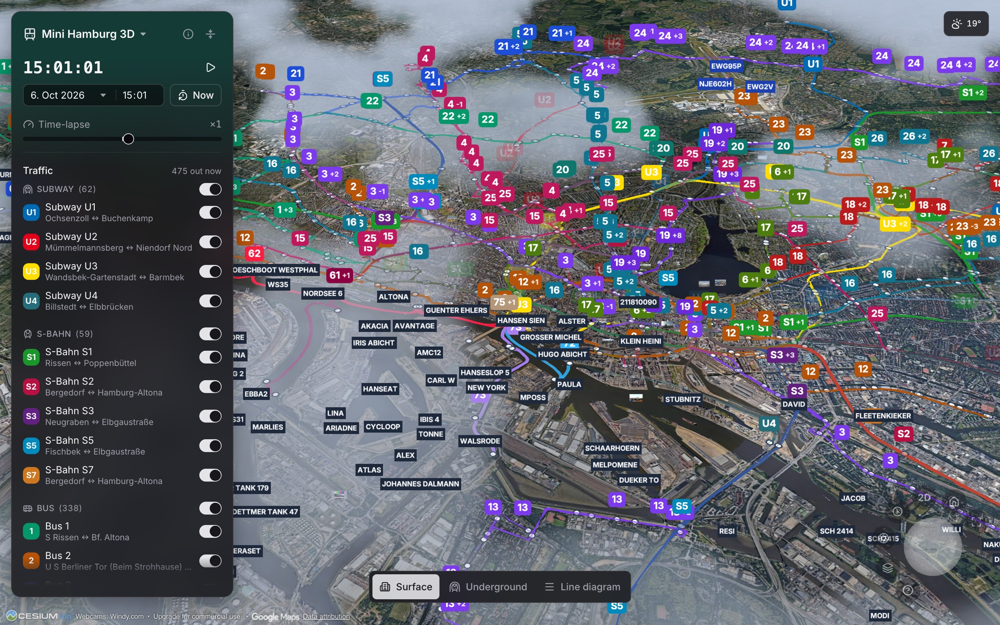
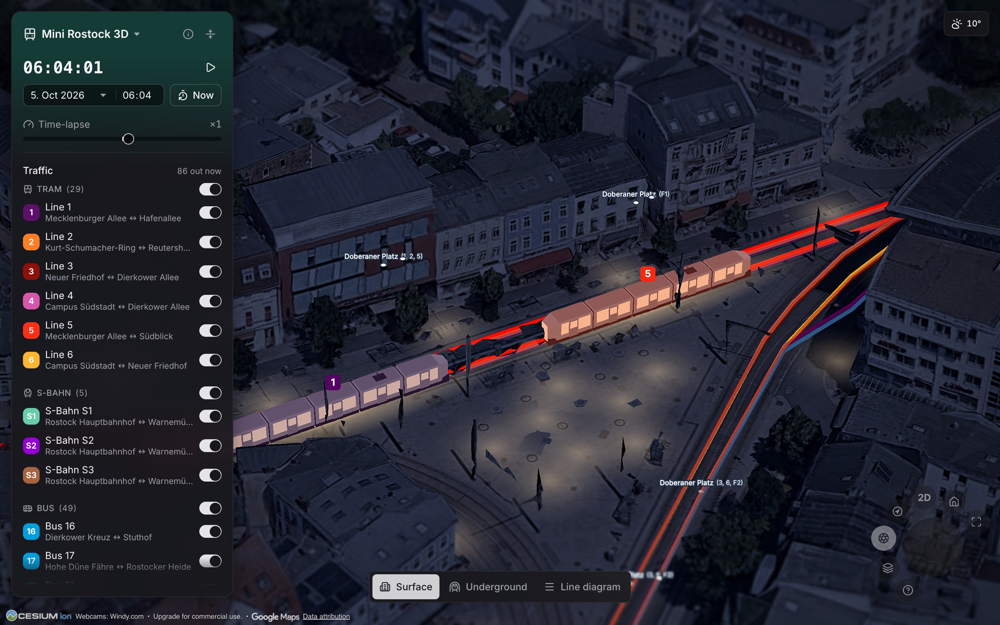
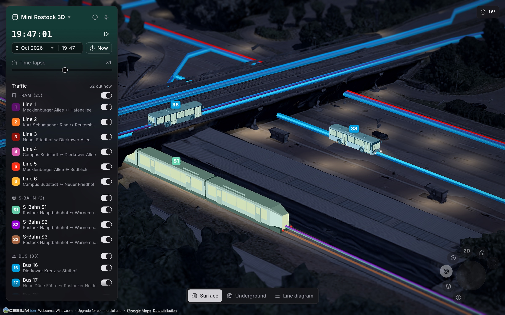
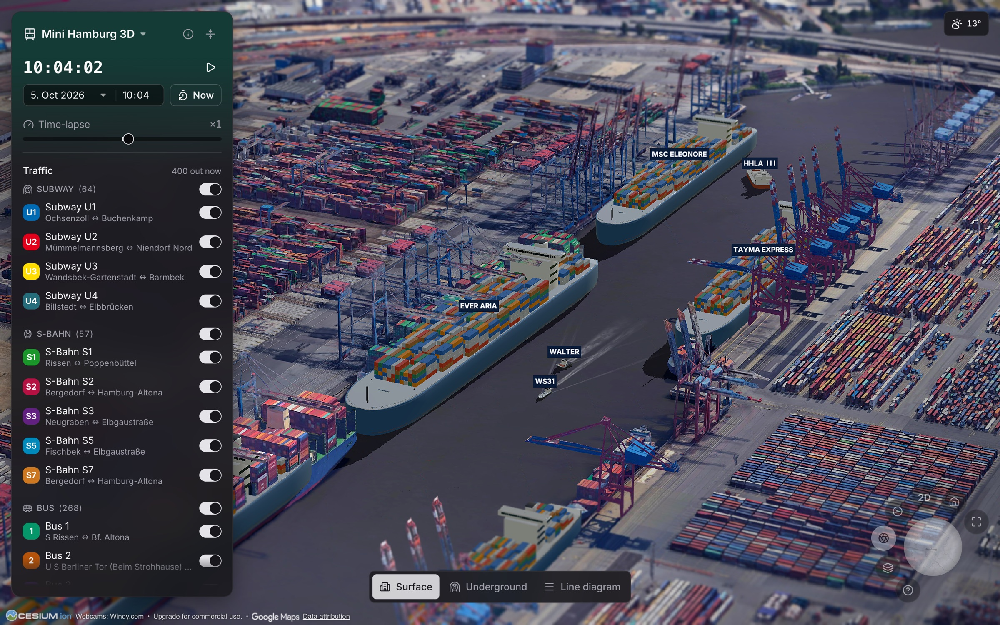
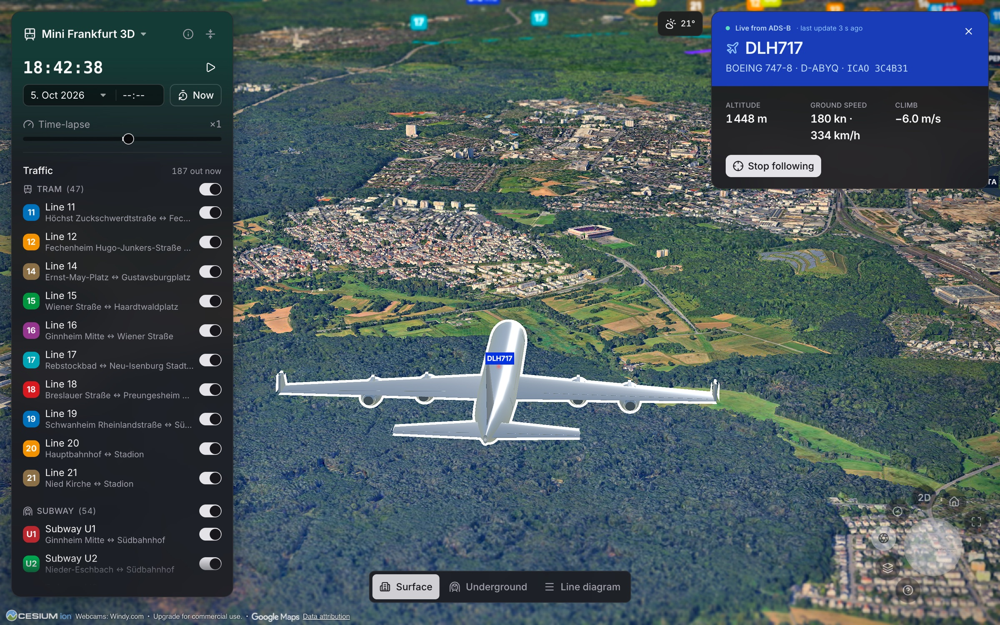
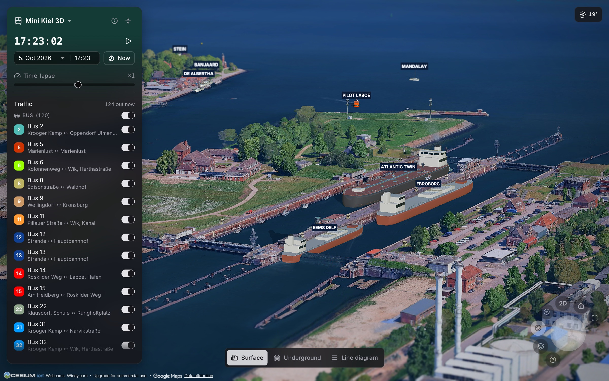
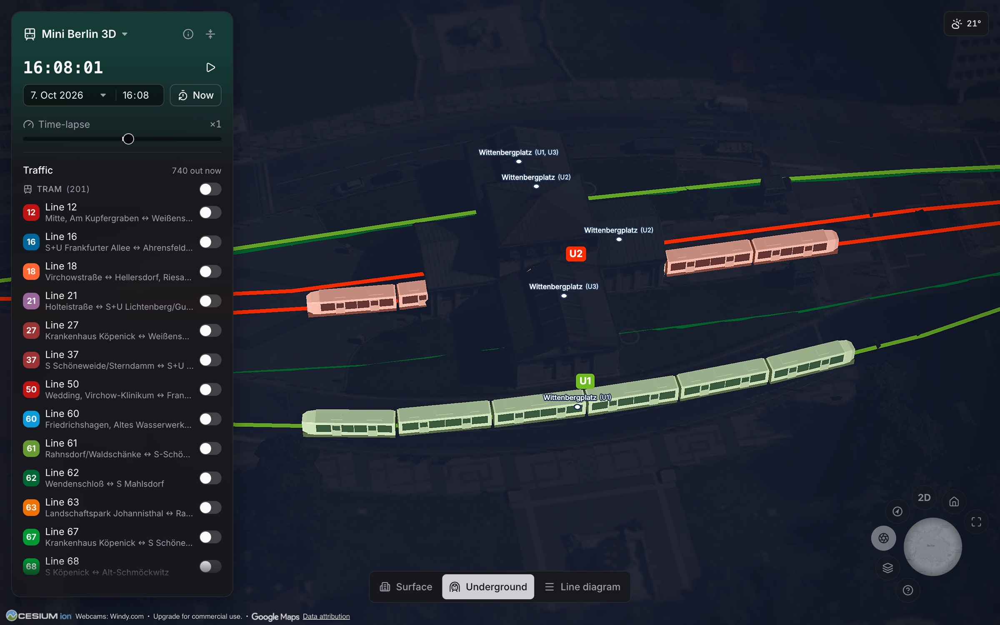
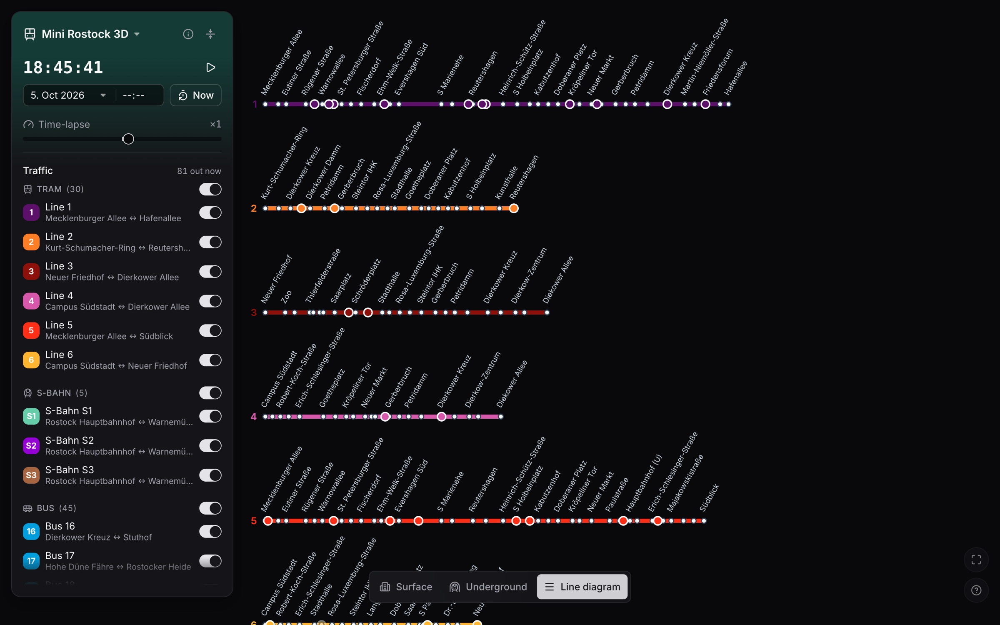
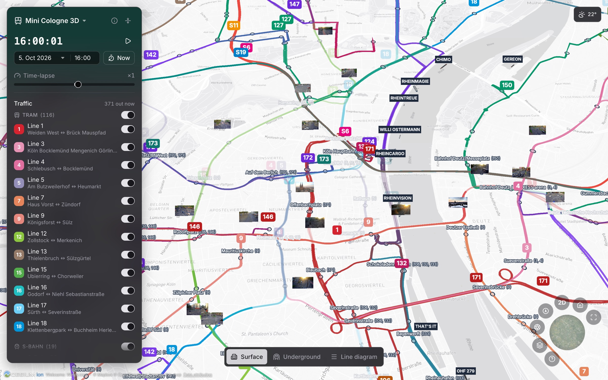

# 🚋 Mini Germany 3D

**The public transport of German cities, live on a photorealistic 3D map.**
Trams, subways, S-Bahn trains, buses and ferries run their real timetables
along their real routes over Google's 3D city models – with the ships in the
harbour and the aircraft overhead where they really are, the weather the city
has right now, and a clock you can set to any moment of the day.

Live at **[minigermany3d.com](https://minigermany3d.com)**. Inspired by
[mini-tokyo-3d](https://github.com/nagix/mini-tokyo-3d), built with
[CesiumJS](https://cesium.com/platform/cesiumjs/) and
[Google Photorealistic 3D Tiles](https://cesium.com/learn/cesiumjs-learn/cesiumjs-photorealistic-3d-tiles/).

[](docs/screenshots/hamburg-harbour.jpg)

Nothing on the map is invented: what runs here runs in reality too, on the same
route at the same time. A line that pauses for the weekend pauses here as well.
Trains and buses are *simulated* from the timetable and the reported delays –
their positions are calculated, not tracked. Ships and aircraft are the
exception: they come from AIS and ADS-B transponders and move when they
transmit.

---

## What you see

**The network, as it runs today.** Every line's real OSM geometry, its stops,
and the GTFS departures of one service day, played back as vehicles – short
workings, tunnels, bridges and the Saturday-only lines included. GTFS-Realtime
delays shift each vehicle along its trip. Clicking a vehicle opens its card and
a chase camera; clicking a stop opens its departure board.

| | |
|---|---|
| [](docs/screenshots/rostock-dawn-trams.jpg) | [](docs/screenshots/rostock-dawn-sbahn.jpg) |
| *Rostock's trams 1 and 5 at Doberaner Platz – the cabin glow and the street lamps follow the simulated clock* | *A Talent 2 on the S1 to Warnemünde* |

**The harbour and the sky, live.** AIS positions from aisstream.io put every
ship in the city's box on the water, as one of sixteen procedural hulls
stretched to her reported size, clamped to the tiles' own water – inland too,
where the river is a staircase of lock reaches. ADS-B positions from adsb.fi
put every aircraft over the city in the air, at cruise as on final, banking
and pitching as reported, landing gear out on approach. Both are recorded: a
clock set back replays the last five days.

| | |
|---|---|
| [](docs/screenshots/hamburg-ships.jpg) | [](docs/screenshots/frankfurt-aircraft.jpg) |
| *Hamburg, Waltershof: the box ships at their berths, each the size AIS reports* | *Frankfurt: following a 747-8 on final, with its ADS-B card* |
| [](docs/screenshots/kiel-ferry.jpg) | [](docs/screenshots/rostock-night.jpg) |
| *Kiel-Holtenau: three ships in the locks of the Kiel Canal, the pilot boat waiting outside* | *Warnemünde, replayed from the AIS archive: the ferry leaving, the mole lights, the buoys' lanterns and the lighthouse's turning beam* |

**A clock, not a feed.** The time field and the calendar set the simulated
moment, the time-lapse runs it at up to ×120 forward or backward, and
everything follows: the sun and the night, the street lamps, the airfield
lights, the lighthouses, the weather of that quarter hour (Open-Meteo keeps
its past), and the recordings of the harbour and the sky.

**Two more readings of the city.** The *line diagram* pulls every line
straight into a row with its stops at their true distances – the vehicles keep
running on the rows – and the *underground* view looks at the city from
beneath its tunnels. The globe on the control dial swaps Google's tiles for a
flat street map.

| | |
|---|---|
| [](docs/screenshots/rostock-diagram.jpg) | [](docs/screenshots/cologne-flat.jpg) |
| *The line diagram: every line a row, every stop at its distance* | *Cologne on the flat map, with Windy's webcams floating over their spots* |

**And the rest, briefly:**

- **Photo mode** – focal length (a dolly zoom), exposure, white balance,
  contrast, saturation, vignette, a framing grid and a tilt-shift miniature
  look with its own knobs; every setting rides in the URL, so a link is a
  picture. A **camera path** bar flies a dolly shot between two saved views.
- **Volumetric clouds** ray-marched from the live cloud cover, drifting with
  the reported wind and shadowing the streets; rain from their base.
- **Night** – the tiles graded into a blue night, a cabin-light pool under
  every vehicle, OSM street lamps along the routes, runway and taxiway lights
  in ICAO colours, buoy lanterns, sector lights and rotating lighthouse optics,
  navigation lights on ships and aircraft.
- **Cards** – vehicle (line, destination, next stop, delay, interchange),
  stop (departures with live countdowns), line, city (the network in numbers,
  as the data states them), ship and aircraft.
- **Webcams** – Windy's cameras as pictures floating over the spot they look
  from.
- **A page per city** – `/berlin/`, `/en/berlin/` – prerendered as plain HTML
  for crawlers, link previews and browsers without WebGL, with a welcome
  screen as the front door, a legal and a privacy notice, and the interface
  in English and German.
- **A phone** gets one sheet at the foot of the screen and a lighter render
  profile.
- **Keyboard** – `Space` pause, `+`/`−` time-lapse, `N` now, `S`/`U`/`L`
  surface, underground, line diagram, `R` home view, `C` turn, `2`/`3` flat
  and tilted, `M` miniature, `F` full screen, `H` hide the interface, `Esc`
  close, `?` About.

## Cities

| City | Lines on the map | Notes |
|---|---|---|
| **Rostock** (default) | 6 trams, ~25 buses, S1–S3, the two Warnow ferries | Street lamps from the city's open-data import |
| **Kiel** | ~40 KVG buses, the SFK ferries F1 and F2 | Routes clipped to the padded box so Laboe and Strande stay on the map |
| **Hamburg** | U1–U4, S-Bahn, 26 Metrobus lines, 8 HADAG ferries | Carries its own terrain tiles where Mapterhorn's import has holes |
| **Lübeck** | 28 city buses, out to Travemünde | No feed carries the Priwall ferry's timetable, so it is left off |
| **Wilhelmshaven** | 14 buses | The AIS backdrop is the point: Germany's only deep-water container port |
| **Bremen** | 8 trams and 3 night trams, ~40 buses, RS1–RS4 | The Weser ferries have no OSM relations and no timetable; AIS shows the boats |
| **Schwerin** | 4 trams, 15 buses | The Pfaffenteich ferry has no timetable in any feed and is left off |
| **Berlin** | U1–U9, S-Bahn, all 22 trams, Metrobus + 100/200/300, 6 BVG ferries | The other 150 bus lines are left out for load (~700 vehicles at rush hour already) |
| **Hanover** | 15 Stadtbahn lines, S-Bahn, 24 buses | The Stadtbahn is a tram to OSM and an underground to GTFS (`gtfs.routeTypes`) |
| **Cologne** | 12 Stadtbahn lines, S6/S11/S12/S19, ~60 KVB buses | The 181 is out until its OSM relation is whole again |
| **Frankfurt** | U1–U9, 10 trams, S-Bahn, Metrobus lines | Express buses are regional and excluded |
| **Stuttgart** | 16 Stadtbahn lines, S-Bahn, 48 SSB buses | Stadtbahn tagged `light_rail` in OSM; the routes climb 300 m |
| **Munich** | U1–U8, S1–S8 and S20, 16 trams, MetroBus and ExpressBus | The U8 is Saturday-only and correctly idle on weekdays; no navigable water, no AIS |

S-Bahn and regional lines are cut at the city limits. Every city has a page of
its own: `/<slug>/` in German, `/en/<slug>/` in English.

## Quick start

```bash
npm install        # also copies the Cesium assets to public/cesium (postinstall)
npm run dev        # → http://localhost:5173
```

Tokens live in `.env` (see [.env.example](.env.example)), never in the source:

| Variable | For |
|---|---|
| `VITE_CESIUM_ION_TOKEN` | Google's 3D tiles via Cesium ion (asset 2275207 must be enabled in the account). Without it the map is a wireframe globe. The deployed site is built with a token restricted to `minigermany3d.com` in `.github/workflows/ci.yml` |
| `VITE_MAPBOX_TOKEN` | The flat map's raster tiles (optional; without it the flat map is a bare globe). The styles must be classic Mapbox styles, see `src/config.ts` |
| `AISSTREAM_KEY`, `WINDY_KEY` | The dev server's AIS and webcam proxies (optional; production reads its own key files, see [Deployment](#deployment)) |
| `VITE_GTFS_RT_URL` | Overrides the realtime endpoint; an empty string disables GTFS-RT |
| `VITE_OPERATOR_NAME`, `VITE_OPERATOR_STREET`, `VITE_OPERATOR_PLACE`, `VITE_OPERATOR_EMAIL` | The provider named in the legal and privacy notices (`src/lib/legal.ts`); placeholders without them. The deployed site takes them from the repository's secrets |

```bash
npm test               # unit tests (Vitest)
npm run test:e2e       # Playwright, fully offline (?offline=1) and deterministic
npm run typecheck      # tsc -b (the solution build; it is what includes tests/)
```

## URLs

The city is the path, everything else is the hash – written as the view
settles, so the address bar is always a link to what you see.

| Parameter | Effect |
|---|---|
| `/kiel/`, `/en/kiel/` | The city, and the language the interface speaks |
| `#lat=…&lon=…&height=…&heading=…&pitch=…` | The camera pose |
| `#vehicle=…`, `#vessel=<mmsi>`, `#aircraft=<hex>`, `#stop=…` | A selection: opens its card and follows it (a ship or aircraft only while it is still reported) |
| `&date=2026-09-14&time=08:30` | The clock as set in the panel – the entry, not the running clock |
| `&view=linear`, `&view=underground` | The line diagram, or the city from beneath |
| `&basemap=flat` | The flat street map instead of Google's tiles |
| `&hide=tram,bus,ais,aircraft` | Traffic categories switched off as a whole |
| `&routes=0&stops=0&labels=0&webcams=0&clouds=1&paused=1` | Layer switches, the 3D clouds, the pause – only where they deviate from the defaults |
| `&tiltshift=1&fov=40&ev=0.5&wb=5600&con=1.2&sat=0.8&vig=0.3&grid=1&blur=…&band=…&fthr=…&foc=…&bok=…&shp=…` | The photo mode, knob by knob, only where a knob stands off its default (`src/lib/photo-settings.ts`) |
| `&path=lat,lon,height,heading,pitch;…&dur=20&ease=linear` | A camera path; `?play=1` flies it once the city is up |
| `?time=08:30`, `?speed=60`, `?paused=1` | Boot flags: the simulation clock, the time-lapse factor (negative runs backward), frozen at start |
| `?offline=1` | No ion/Google access, wireframe globe (the basis of the tests) |
| `?welcome=0` / `?welcome=1` | Skip the welcome screen for this visit, or force it |
| `?lang=de` / `?lang=en` | Force the interface language for one visit |
| `?rt=0`, `?rain=0`, `?lamps=0`, `?seamarks=0`, `?webcams=0`, `?ais=0`, `?aircraft=0` | Leave the realtime delays, the live weather, the night lighting, the buoys and lighthouses, the webcams, the ships or the aircraft out |
| `?tier=mobile` / `?tier=desktop` | Force the render profile (`src/lib/render-profile.ts`) |
| `?sse=<n>`, `?drops=<n>` | Debug: the tile screen-space error, the rain pool cap |

## Data

A city is a folder under `src/cities/` with a hand-written definition and the
files the pipeline generates for it:

```
src/cities/kiel/
├── city.json             # the definition (below)
├── limits.json           # the city limits polygon – written by add-city, read by the pipeline
├── network.json          # lines, routes, stops – data:update, data:simplify, data:heights
├── schedule.json         # real departure times – data:gtfs
├── street-lamps.json     # OSM lamps along the routes – data:lamps
├── airfield-lights.json  # OSM runway and taxiway lights in the box – data:airfield-lights
├── buoys.json            # OSM buoys in the box – data:buoys
├── lighthouses.json      # OSM lighthouses and pier lights in the box – data:lighthouses
└── terrain/              # the city's own terrain tiles over Mapterhorn's – optional
```

**Sources.** Routes, stops, tunnels, bridges, lamps, airfield lights, buoys
and lighthouses come from OpenStreetMap through Overpass. Terrain heights come
from [Mapterhorn](https://mapterhorn.com)'s tiles, built from the states'
open 1 m elevation models, sampled per route vertex, stop and lamp (bridge
decks are measured on Google's tiles at run time instead, since a bare-earth
model knows no viaduct). Timetables come from the Germany-wide
[gtfs.de](https://gtfs.de) feed (DELFI): one service day per city, the
busiest of the next three weeks, every trip with its own stop times (as
shared patterns, so a city's file stays small; where the free feed
carries only a trip's first time, as for Bremen's and Hanover's buses and
trams, the run between stops is derived from the route length) and the
GTFS trip ids kept for matching the realtime feed. Lines without GTFS trips stay off the map
– a line that is suspended for track works does not run here either.

**`city.json`** (typed and validated by `src/lib/city.ts`):

- `cityBounds`, `paddingMeters`, `boundingBox` – the city limits from OSM
  (`osmRelation`, the largest outer ring) and the padded rectangle everything
  shares: the pipeline's queries, the AIS subscription, the camera's leash
  (20 km on every side by default).
- `home` – the home view; `weather` – where the live weather is queried.
- `network` – the modes to fetch, how each mode's relations are narrowed in
  OSM (`overpass`: operator, ref, service, network as regexes; `osmRoutes`
  where the city's tagging differs), lines addressed by relation id
  (`fixedLines`, ferries mostly), and where a route leaving the city is cut
  (`clip`: `city`, `box`, `none`).
- `gtfs` – the feed's stop-name prefix (`nameStrip`), the branch stations
  that tell an S-Bahn's legs apart (`trainBranches`), the `route_type` values
  a mode is looked up under where the feed disagrees (`routeTypes`).
- `fleet` – per mode the vehicle dimensions and the glTF consist
  (`VEHICLE_CONSISTS` in `src/map/VehicleLayer.ts`).
- `terrain` – the Mapterhorn zoom, the geoid offset, the water level ferries
  ride at (`null` where the terrain carries the lakes, as Berlin's does), the
  attribution line the state's licence asks for.
- `ais` – whether the backdrop is on, and the MMSIs of ships the map already
  runs from a timetable (`simulatedByMmsi`), so no crossing carries two boats.
- `webcams` – Windy camera ids to leave off.

**Adding a city:**

```bash
node scripts/add-city.mjs kiel 27021        # bounds from OSM → src/cities/kiel/city.json
# edit city.json: home view, modes/operators, fleet, terrain, ferries' AIS twins
npm run data:update -- --city kiel          # then data:simplify, data:heights, data:lamps,
                                            # data:airfield-lights, data:buoys, data:lighthouses
npm run data:gtfs                           # once for every city – the feed is streamed once
node scripts/build-og-images.mjs            # link-preview picture → public/og/kiel.png
node scripts/build-globe-images.mjs         # the rail globe's stills → public/globe/
```

…then list it in `src/cities/definitions.ts` and add `city.name.kiel` to both
i18n tables and a `tests/kiel.test.ts`. Every script takes `-- --city <slug>`
and runs for every city without it. The unit tests validate every city's
definition and network.

**Refresh.** A scheduled CI run refreshes the data every second night: the
GTFS schedules on every run, the OSM network and its heights on the weekend's
run, the lamps, airfield lights, buoys and lighthouses on the month's first
weekend. Files are byte-stable across reruns, so a night that changed nothing
deploys nothing. Overpass mirrors fail often; the scripts retry and can be
pointed at `OVERPASS_URL=…` or a saved `OVERPASS_FILE=…`. The GTFS feed is
cached under `scripts/.cache/gtfs.zip`.

### Live data

| Feed | Endpoint | What happens |
|---|---|---|
| **GTFS-Realtime** (gtfs.de, TripUpdates) | `/api/realtime?city=…` | The >10 MB feed is fetched once a minute server-side, filtered to the city's trip ids, and polled by the browser every two minutes. Delays shift vehicles along their trips; no vehicle positions |
| **AIS** (aisstream.io) | `/api/ais?city=…` | One WebSocket subscribed to every city's box; the production keeper listens in 45 s windows from a cron. Every fix is archived per city and UTC hour, five days kept, and replayed when the clock is set back |
| **ADS-B** (adsb.fi open data) | `/api/aircraft?city=…` | Polled every five seconds per city; a keeper polls one circle over all cities every ten seconds from a cron and records five days. Playback 12 s behind, dead-reckoned 20 s ahead; landings come down onto the clamped runway |
| **Weather** (Open-Meteo) | direct | Rain, cloud cover, temperature, wind and visibility on a quarter-hour grid, the last five days included, so the sky follows the simulated clock |
| **Webcams** (Windy) | `/api/webcams?city=…` | Pictures polled every ten minutes through a proxy that keeps the key |

Each endpoint has a Vite middleware for development and a PHP twin in
`server/api/` for shared hosting; parity scripts (`scripts/test-*.mjs`) hold
the two to the same output and run in CI.

## Deployment

`.github/workflows/ci.yml` typechecks, tests, builds and rsyncs `dist/` plus
the PHP scripts and each city's `city.json` and `schedule.json` to an all-inkl
webspace (Apache + PHP) after every push to `main`. Secrets:
`KAS_SSH_HOST`, `KAS_SSH_USER`, `KAS_SSH_PASSWORD`, `KAS_TARGET_DIR` (the
document root as rsync sees it, `websites/mini-germany-3d/website/`),
`WINDY_KEY`, and the provider's details for the legal notice as
`OPERATOR_NAME`, `OPERATOR_STREET`, `OPERATOR_PLACE` and `OPERATOR_EMAIL`. The rsync deletes what it does not carry, so everything the site
reads or writes at run time sits *beside* the document root, never in it:

```
websites/mini-germany-3d/            ← KAS_TARGET_DIR's parent
├── aisstream.io-api-key.txt         # read by api/ais.php
├── windy-api-key.txt                # fallback for api/webcams.php
├── ais-archive/<slug>/*.ndjson      # written by api/ais.php, five days kept
├── aircraft-archive/<slug>/*.ndjson # written by api/aircraft.php?record=…, five days kept
└── website/                         ← KAS_TARGET_DIR, the domain points here
    ├── index.html, assets/, …       # the build – an index.html per city and language
    └── api/                         # the PHP scripts and their city.json copies
```

Two crons keep the recordings going, each every minute:
`/api/ais?listen=45` and `/api/aircraft?record=50`. A manual workflow run
with `deploy_preview` puts a branch on the live site (there is only one
document root), `restore_production` puts the last good `main` build back
in a minute; builds are kept as artifacts named after their source tree and
reused across runs.

## Architecture

```
src/
├── config.ts               # tokens, camera, simulation parameters – the same for every city
├── cities/                 # definitions.ts (the list), index.ts (lazy data per city), <slug>/
├── data/                   # the generated files' types and preparation (distances, mirroring, fleet)
├── lib/                    # pure logic: city.ts, clock.ts, timetable.ts, geo.ts, tunnels.ts,
│                           # camera-hash.ts, camera-path.ts, site-path.ts / site-pages.ts (the pages),
│                           # legal.ts, i18n.ts, weather.ts, the AIS/ADS-B/GTFS-RT clients and their
│                           # shared extractors and archives, nav-lights.ts, seamark-lights.ts,
│                           # lighthouse-beam.ts, linear-layout.ts, render-profile.ts, …
├── engine/simulation.ts    # clock + timetable → vehicle snapshots per tick
├── map/CesiumMap.ts        # viewer, Google tiles, the leash and home view, the flight between
│                           # cities, follow camera, day/night, event-driven render requests
├── map/*Layer.ts           # routes, stops, lamps, airfield lights, buoys, lighthouses, vehicles,
│                           # AIS vessels, ADS-B aircraft, webcams – each with clear() for the next city
├── map/*.ts                # the stateless effects: FunnelSmoke, Wake, NavLights, LighthouseBeams,
│                           # StopDiscs, CloudLayer, the photo grade and tilt-shift passes,
│                           # bridge-decks, water-clamp, the flat basemap, LinearView (the diagram)
├── components/             # shadcn-style UI: welcome screen, control panel, cards, popovers,
│                           # the camera path bar, the About/Credits/Legal dialogs, ui/*
└── App.tsx                 # the viewer effect (once), the city session effect (per city),
                            # the render loop's pacing, the test API (window.__mg3d)

server/api/                 # realtime.php, ais.php, aircraft.php, webcams.php – the PHP twins
scripts/                    # the data pipeline (fetch-*.mjs, simplify-network.mjs, add-city.mjs),
                            # build-vehicle-models.mjs (procedural GLBs for vehicles, ships, aircraft,
                            # buoys), build-og-images.mjs, build-globe-images.mjs,
                            # build-readme-screenshots.mjs, build-terrain-patch.mjs, test-*.mjs (parity)
tests/                      # Vitest – incl. one file per city pinning its lines, heights and fleet
e2e/                        # Playwright, offline and deterministic
```

**How the simulation works.** Departures come from `schedule.json`; the
travel time between stops follows from the real track distance at a
mode-specific cruise speed plus a dwell. Every tick the distance along the
route is interpolated per active trip and turned into a position and heading.
Vehicles ride the route's terrain profile and, on a bridge, the deck measured
on the tiles; the ferries and ships float on the tiles' own water through a
rationed clamp pick; stops re-measure their height as the camera approaches.
Rendering is event-driven: frames are drawn when something on screen has
moved by half a pixel, not on a timer.

**A city switch** is a swap, not a reload: the viewer, the tileset and the
render loop live for the session, a city is a session on top of them. The
camera flies to the next home view, the layers of the old city go down halfway,
the new city's data chunk comes in.

The decisions behind all of this – what was measured, what was tried and
dropped, and what must not be re-litigated – are written down in
[CLAUDE.md](CLAUDE.md).

## Attribution

- Map rendering: [CesiumJS](https://cesium.com) (Apache-2.0); tiles © Google –
  use of the Photorealistic 3D Tiles is subject to the Google Maps Platform
  terms; the attribution is displayed by Cesium
- Network data, street lamps, airfield lighting, buoys and lighthouses:
  © OpenStreetMap contributors, ODbL 1.0
- Flat map: © [Mapbox](https://www.mapbox.com/about/maps/)
  © [OpenStreetMap](https://www.openstreetmap.org/copyright) contributors –
  Mapbox's Static Tiles API, with its attribution and "Improve this map" link
  on the map while the flat map is up
- The globe on the control rail: three stills per city from Mapbox's Static
  Images API – the light and the dark map © Mapbox © OpenStreetMap, the
  satellite picture © Mapbox © Maxar – credited in the credits dialog
- Webcam pictures: [Windy.com](https://www.windy.com/webcams) Webcams API –
  shown as delivered, each linked to its windy.com page, with the courtesy
  line in the credit display
- Air traffic: [adsb.fi](https://adsb.fi) open data – for personal,
  non-commercial use, cited with a link in the credits dialog
- Harbour traffic: [aisstream.io](https://aisstream.io)
- Weather: [Open-Meteo](https://open-meteo.com) (CC BY 4.0)
- Terrain heights: © [Mapterhorn](https://mapterhorn.com/attribution), built
  from © GeoBasis-DE/M-V (DGM1, CC BY 4.0) for Rostock and Schwerin, from
  © GeoBasis-DE/LVermGeo SH (DGM1, CC BY 4.0) for Kiel and Lübeck, from
  © Freie und Hansestadt Hamburg, Landesbetrieb Geoinformation und Vermessung
  (DGM1, dl-de/by-2-0) for Hamburg (`src/cities/hamburg/terrain/`, the same
  model Mapterhorn's Hamburg tiles are built from), from © Landesamt
  GeoInformation Bremen (ATKIS DGM1, CC BY 4.0) for Bremen, from Geoportal
  Berlin / ATKIS DGM (Senatsverwaltung für Stadtentwicklung, Bauen und Wohnen,
  dl-de/zero-2.0) for Berlin, from Geobasis NRW – DGM1 (Land
  Nordrhein-Westfalen, dl-de/zero-2.0) for Cologne, from © Bayerische
  Vermessungsverwaltung (DGM1, CC BY 4.0) for Munich, from © Landesamt für
  Geoinformation und Landesvermessung Niedersachsen (DGM1, CC BY 4.0) for
  Hanover and Wilhelmshaven, from © Hessisches Ministerium für Umwelt,
  Klimaschutz, Landwirtschaft und Verbraucherschutz (ATKIS-DGM1,
  dl-de/zero-2.0) for Frankfurt and from © LGL, www.lgl-bw.de (DGM1,
  dl-de/by-2-0) for Stuttgart – shown in the app inside Cesium's "Data
  attribution" credits
- Timetable data: [gtfs.de](https://gtfs.de) / DELFI – observe the source's
  licence terms
