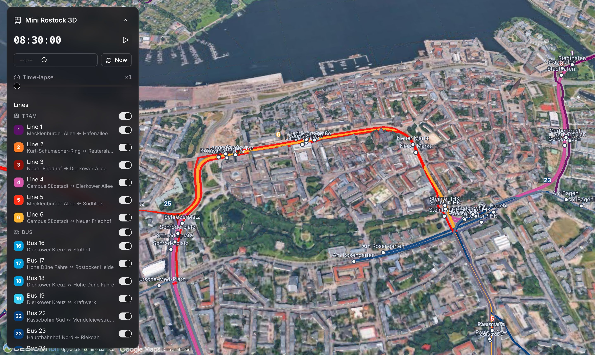
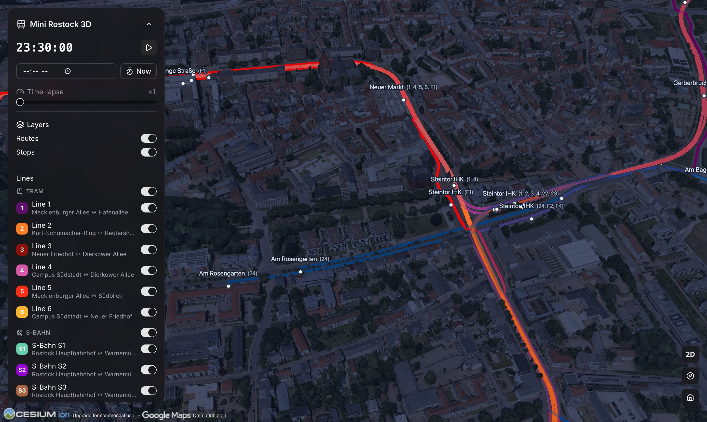

# 🚋 Mini Germany 3D

**The public transport of German cities, live on a photorealistic 3D map** –
inspired by [mini-tokyo-3d](https://github.com/nagix/mini-tokyo-3d), built with
[CesiumJS](https://cesium.com/platform/cesiumjs/) and
[Google Photorealistic 3D Tiles](https://cesium.com/learn/cesiumjs-learn/cesiumjs-photorealistic-3d-tiles/).

One city at a time – the caret beside the panel title lists the others and
flies you there. Trams, subways, S-Bahn trains, buses and ferries run
schedule-based along their real routes through the city – with time-lapse,
line filters, a stops layer, a chase camera that follows vehicles, shareable
view and vehicle links, day/night lighting that follows the simulated time
(including a night-time cabin glow under the vehicles), and a UI styled after
[shadcn/ui](https://ui.shadcn.com/).

It started as **Mini Rostock 3D** and Rostock is still the city it opens on.
Hamburg is the second one; adding a city is a folder, a `city.json` and a run
of the data pipeline (see [Cities](#cities)).





---

## Features

| Feature | Details |
|---------|---------|
| Several cities, one map | Every city is a definition (`src/cities/<slug>/city.json`) plus generated data next to it. The caret beside the panel title switches; the old city's routes, stops, lamps and vehicles are taken down, the camera flies to the next city's home view with the leash lifted, and the new city's data comes in as a lazy chunk of its own. `#city=<slug>` in the URL names the city a link opens on |
| Cesium map with Google 3D Tiles | `createGooglePhotorealistic3DTileset` via Cesium ion, falls back to a wireframe globe when unreachable (the tests run on that offline mode, `?offline=1`) |
| Vehicles as low-poly consists on real routes | Procedural glTF models after the real fleets, picked per city and line – Rostock's five-section Vossloh 6N2 tram (32 m), three-car Talent 2 S-Bahn (57 m), 12 m buses and its two Warnow ferries as their real double-enders; Hamburg's DT5 subway (39.6 m), ET 490 S-Bahn (66 m) and HADAG harbour ferries – each with glazing, grey roofs, pantographs or bridges. Muted livery with a hint of the line color, schedule-based simulation (see [Data](#data--gtfs--gtfs-realtime--osm)) |
| Routes/lines on the map | Polylines at absolute terrain heights in line colors where the city has a terrain source, clamped onto the tiles where it has none; zooming to a line pulses its route while all other lines briefly step aside; tunnel sections at reduced opacity |
| Lines pulled straight | A switch turns the map into a diagram: every line becomes a row of its own, its stops sitting along it at the distance they really are, and the city fades out underneath. The camera climbs straight above the middle of the drawn network first and only then do the lines straighten – a plan is the reading closest to the diagram, and it puts every line on screen for the transition. It frames what is switched on, not the city: with two lines showing, the plan is of those two. Leaving runs backwards: the lines fold onto the map and only then does the camera fly, home by default or to whatever the press was aiming at – flying to a stop, following a vehicle or zooming to a line all bring the map back and then go there. It is a morph, not a cut – each line leaves the screen position the map has it at and is drawn straight from there, because the map and the diagram read the same number, the distance along the route. Only one of the two ever draws the network: the map lets go of its routes, stops, vehicles and names the frame the morph starts and takes them back the frame it ends, and since the two lie exactly on top of each other at rest, neither handover has anything to show. The vehicles travel over with it and keep running on the rows. One shared scale for every row, so a 50 km line stays five times the length of a 10 km one; the panel's line filter is the diagram's filter too. The three readings – surface, underground, line diagram – are tabs at the foot of the map, exactly one lit, each reachable from each. `#…&view=linear` and `#…&view=underground` open straight into a reading; the surface needs no word |
| Stops layer | One disc + name plate per stop position, the serving lines in parentheses ("Kröpeliner Tor (1, 4, 5, 6)"), screen-space label decluttering (nearest wins), stops disappear with their lines |
| Miniature look (tilt-shift) | A screen-space band of focus with the frame blurred above and below it – the blur disc grows with the distance from the band like a real circle of confusion, highlights spread into bright bokeh instead of averaging away, the band itself is crisped – plus a toy-plastic grade and a vignette: the shallow depth of field a tilted lens gives a model. Three post-process passes (the blur runs on a quarter-size frame), ramped down by the camera pose and off at street level or looking straight down. Off when the app opens (`config.camera.miniatureDefault`); the aperture button in the camera block and `tiltshift=1` turn it on – it is a lens on the map rather than a command to it, which is why it sits with the camera |
| Day/night lighting | Sun-elevation-based grading of the photo tiles plus a dynamic sky (stars at night), driven by the simulated clock – at night every vehicle casts a warm cabin-light pool onto the road |
| Street lighting at night | For cities that ask for it: a warm light pool under every OSM street lamp along the routes – in Rostock ~7000 of them from the city's open-data import; fades in with the sun ramp and out as the camera climbs |
| Stop departure board | Clicking a stop opens its card: serving lines, the next departures with live countdowns and GTFS-RT delays, nearby lines a short walk away – a departure whose vehicle is already on the map links straight to it |
| Interchange at a stop | The lines reachable from the stop the vehicle stands at (or heads for), collected across every platform within 100 m |
| Follow & camera | Follow mode flies in behind the vehicle and chases it facing the direction of travel until you rotate (zooming keeps the chase); a live compass, 2D/3D, and camera-reset buttons sit at the lower right |
| Live delays | GTFS-Realtime TripUpdates overlaid on the schedule simulation, filtered per city (see [GTFS-Realtime](#gtfs-realtime-implemented-filtered-server-side)) |
| Weather | Open-Meteo precipitation, cloud cover and temperature for one point per city in one request: falling rain plus an overcast grade on the photo tiles, so a grey day stays grey without rain, and the reading in °C on the weather button. The live sky is shown only near real time (`?rain=0` opts out); the weather popover swaps it for a sunny, overcast or rainy one, which holds whatever the clock says, while the temperature beside the icon stays the real one |
| Live harbour traffic | AIS positions from aisstream.io as a backdrop fleet, one subscription for every city's box and served per city (`/api/ais?city=…`); the city ferries' AIS twins are left out so no crossing carries two boats. Thirteen low-poly archetypes carry it – container ship, coaster, tanker, inland barge, hopper dredger, passenger ship, harbour launch, pilot boat, tug, fishing boat, yacht, motorboat, workboat – each stretched to the ship's reported size. AIS has no code for a container ship and one bucket for every dry cargo ship there is, so where the code says nothing the size does: a 400 m box on the Elbe gets the boxship, an 85 × 9.5 m one the inland barge (see `archetypeFor` in `src/map/VesselLayer.ts`) |
| shadcn(-style) interface | Tailwind v4 + Radix primitives, shadcn component styling (Card, Button, Badge, Switch, Slider, Popover, Tabs) |
| Interface out of the way | `H` hides the whole interface – panel, cards, map controls – and brings it back, for a clean look at the city. What the map itself draws (stop plates, vehicle numbers, ship names, routes) is untouched; the Layers switches are what turn those off, and Cesium's credit line stays either way. Not shared in the URL: a reload always brings the interface back |
| Full screen | A button in the lower-right column puts the page full screen and takes it back out; it follows Escape and F11 too, and is left out where the browser has no Fullscreen API (iOS Safari) |
| Automated tests | Unit tests (Vitest) and functional E2E tests (Playwright), fully offline and deterministic |

## Quick start

```bash
npm install        # also copies the Cesium assets to public/cesium (postinstall)
npm run dev        # → http://localhost:5173
```

**Cesium ion token:** No token lives in the source. A local checkout takes it
from `.env` (see `.env.example`); without one the map falls back to the
wireframe globe:

```bash
VITE_CESIUM_ION_TOKEN=your-token
```

> Ion tokens are client-side, publishable tokens – they inevitably end up in the
> browser bundle. That is exactly why the deployed site is built with a token
> restricted to `minigermany3d.lampenbauer.com` in the
> [Cesium ion dashboard](https://ion.cesium.com/tokens), which makes it useless
> anywhere else; it sits in `.github/workflows/ci.yml` and every CI build uses it,
> so that two builds of the same source tree are byte-equal and interchangeable
> (see [Deployment](#deployment-all-inkl-webhosting)). For the
> Google 3D Tiles, access to *Google Photorealistic 3D Tiles* (asset 2275207) must
> be enabled in the ion account.

### Usage

- **Cities:** The caret beside the panel title lists every city this build
  knows; picking one takes the current city off the map, flies the camera to
  the new city's home view and puts that city's lines up. The URL follows
  (`#…&city=hamburg`; the default city Rostock needs no name), and the last
  city visited is remembered by the browser for the next session.
- **Simulation time:** The panel's time field opens the native picker (e.g. jump to
  rush hour); "Now" restores the real time. Time-lapse 1–120× and pause work at any
  time, and the collapsed panel keeps showing the clock and the pause button.
  The scene lighting follows the simulated clock, so the time input doubles as a
  day/night switch – and the ×120 time-lapse shows a full day/night cycle.
- **Zoom to a line:** Clicking a line's name in the panel flies the camera so the
  whole route fits into view (the compass heading is kept); the route pulses for
  three seconds while every other line fades out. Clicking a hidden line switches
  it back on first.
- **Selecting a vehicle:** Clicking a box opens the info card (line, destination,
  next stop) at the top right. Its interchange row lists the lines a passenger can
  change to – while the vehicle stands at a stop those are that stop's connections,
  and only once it pulls away do they become the next stop's. A junction is several
  stops in the data (one per platform, at Doberaner Platz eight of them up to 91 m
  apart), so the lines are collected by walking distance rather than by stop id.
  "Follow" flies the camera in behind the vehicle and
  chases it facing the direction of travel; rotating the camera hands control back
  to free orbit (zooming keeps the chase). Clicking empty map, "Stop following", or
  a camera reset ends the follow mode.
- **Pulling the lines straight:** The top button of the map controls swaps the
  city for a diagram of it – every line straightened into a row, the stops along
  it where their distance puts them, the vehicles running on the rows. The camera
  climbs straight above the middle of whatever is switched on, keeping its compass
  heading, and the lines only begin to straighten once it is there – switch most
  of the network off and the plan is of the handful of lines that are left. Every
  tab is reachable from every other: picking the underground while the diagram is
  up brings the lines down onto the map first and takes the camera under the city
  afterwards. The way back is the
  same order backwards: the lines fold onto the map, and only once they are down
  does the camera move – to the city's home view, or, when the press was aiming
  at something (a stop to fly to, a vehicle to follow, a line to zoom to), to
  that instead. The lines
  travel there from where the map has them, so it stays readable which line went
  where. Only the lines switched on in the panel are drawn, clicking a dot or a
  stop opens the same cards as on the map, and the button turns the city back on.
  The diagram scrolls when the network is taller than the window.
- **View tabs:** centred at the foot of the map, exactly one of them lit –
  Surface, Underground, and Line diagram: the city as it stands, the same city
  from underneath, and the network with the city taken away. ("Line diagram" is
  what an operator calls the strip over the door, `Linienband` in German – one
  line drawn straight with its stops along it.) They stand apart from the
  controls at the right because they are the only ones that do not aim the
  camera – they replace what the camera looks at. The words appear from 1120px
  up, where the group still clears the panel; below that the icons carry it
  alone. Arrow keys move between the tabs, Enter picks.
- **Map controls:** at the lower right edge of the map, one block – compass,
  2D/3D pitch toggle, camera reset, the miniature look, and full screen last.
  All of it belongs to the map, so the diagram keeps only full screen.
- **Weather popover:** upper right, the opposite corner from the camera controls
  – it dresses the map rather than commanding it. That corner belongs to the
  cards whenever one is up, and the button gives it up entirely rather than
  hiding underneath: it leaves the page until the card is closed.
- **Compass:** its needle points where the camera looks, on a north-up dial, and
  turns with it. Pressing it brings the view onto the nearest quarter – north,
  east, south or west – and on to the next one when it already stands on one, so
  pressing on walks the map round the dial and past north. The button says which
  quarter it will turn to before you press it.
- **Weather popover:** the sky the city is shown under. Four skies – the live weather
  and a sunny, an overcast and a rainy one – of which exactly one is in force;
  a picked one is set rather than polled, so it works offline and survives a
  time-traveled clock, and the button wears its icon and lights up while it is
  not the sky the session opened on. Beside the icon it carries the temperature
  over the city, which stays the live reading under a picked sky – that sky is a
  way to look at the city, not a claim about the weather. Where there is no live
  weather to reach (offline, `?rain=0`, no endpoint) the session opens on the
  clear sky, the live tile is greyed out and the button shows its icon alone.
- **Field of view:** 25° horizontal while the miniature look is on, Cesium's
  60° default while it is off (`config.camera.fovDeg` / `fovOffDeg`), eased
  between the two when the switch is flipped – and the camera walks along the
  view axis as it goes, so the same ground stays in frame and only the
  perspective flattens or steepens. A dolly zoom, in other words: the switch
  shows the lens change the effect is built on instead of jumping somewhere
  else. The miniature look lives on the long-lens end: a
  narrower angle keeps the foreground from looming and towers from leaning out of
  the frame, and it makes the tilt-shift band a better stand-in for a plane of
  focus – at 60° the blurred edges span 1.5× the depth of the sharp band, at 25°
  well under half of that. Every distance measured at 60° follows the angle: the home view, the
  chase cam and the stop flight read it off the camera and keep their framing
  through either lens. The ranges that decide what is still worth drawing (stop
  discs and labels, vehicle bodies, badges and ships) stay pinned to the narrow
  one – they live in DistanceDisplayConditions on thousands of billboards, too
  many to rebuild on a toggle, so through the plain lens they simply reach a
  little further than that angle needs. The line flight needs none of it – Cesium
  derives that distance from the frustum itself.
- **Map bounds:** The camera stays inside the city's bounding box – the city
  limits (an OSM boundary relation) widened by 15 km on every side, the one
  rectangle the data pipeline, the AIS subscription, the PHP proxy and the
  camera share (`boundingBox` in the city's `city.json`, typed by
  `src/lib/city.ts`) – and does not zoom out beyond 25 km altitude: there is
  nothing outside that this map could show, and every place the camera visits
  pulls its own 3D tiles. A shared link pointing further away opens at the
  border (see `config.cameraLimits`). Only the flight from one city to the
  next lifts the leash, and the next city's takes over on arrival.
- **Night lighting:** From dusk the streets along the routes light up – one
  light pool per OSM street lamp, the same effect the vehicles' cabin glow
  uses – in cities whose definition enables it. Nothing is built until the
  pools would actually show, so a daytime session pays nothing for it; the
  underground view puts them out, and `?lamps=0` leaves them out entirely.
- **Selecting a stop:** Clicking a stop disc or name plate opens its departure
  board: the lines calling there, the next departures within the hour (soonest
  first, GTFS-RT delays applied, after-midnight service handled), and the lines
  boarding a short walk away. A departure whose vehicle is already on the map is
  a link – clicking it jumps to that vehicle's card. Underground platforms are
  marked, and "Fly to stop" brings the camera in.
- **Sharing links:** The URL hash always mirrors the current view, written
  event-driven when the camera settles (no polling). Without a selection it carries
  the camera pose; while a vehicle is selected it is just `#vehicle=<trip-id>` –
  opening such a link re-selects the vehicle and starts following it. The city,
  the Routes/Stops layer toggles, the miniature look and the pause state ride along
  as `city=hamburg`, `routes=0`, `stops=0`, `tiltshift=1`, `paused=1` whenever they
  deviate from the defaults (Rostock, layers on, miniature look off, clock running).

### Useful URL parameters

| Parameter | Effect |
|-----------|--------|
| `?offline=1` | No ion/Google access, wireframe globe (basis of the tests) |
| `?speed=60` | Initial time-lapse factor (1–600) |
| `?time=08:30` | Set the simulation time (Europe/Berlin) |
| `?paused=1` | Start with the simulation frozen |
| `?rt=1` / `?rt=0` | Force GTFS-Realtime on/off (default: on, except in offline mode) |
| `?lang=de` / `?lang=en` | Force the UI language (default: English, or German when the browser prefers it) |
| `?lamps=0` | Disable the night-time street lighting |
| `?drops=40` | Cap the rain drop pool (debug/E2E – visible rain pins the render loop at animation rate) |
| `?rain=0` | Disable the live-weather overlays (real Open-Meteo precipitation and cloud cover, shown only near real time) |
| `?ais=0` | Open with the live AIS ships switched off – the "AIS ships" switch at the end of the traffic list turns them back on |
| `#city=hamburg` | The city to open on (the default city needs none; unknown slugs fall back to it) |
| `#lat=…&lon=…&height=…` | Saved camera pose (maintained automatically) |
| `#vehicle=…` | Shared vehicle selection – opens with the vehicle selected and followed |
| `#stop=…` | Shared stop selection – opens the stop's departure board and flies to it |
| `#…&view=linear` / `#…&view=underground` | Which reading of the network to open on – the lines pulled straight, or the city from underneath. The surface is the map itself and needs no word |
| `…&routes=0&stops=0&tiltshift=1&paused=1` | Layer toggles, the miniature look and the pause state (only present when they deviate from the defaults: layers off, miniature look on, paused) |

## Tests

```bash
npm test               # Unit tests (Vitest): geodesy, timetable engine, clock, city definitions, network validation, UI
npm run test:e2e       # Functional E2E tests (Playwright, fully offline & deterministic)
```

The E2E tests start the real app in offline mode with a frozen simulation time
(08:30) and render Cesium headless via SwiftShader. Everything runs automatically
in CI (GitHub Actions), see `.github/workflows/ci.yml`.

## Cities

A city is a folder under `src/cities/` with a hand-written definition and
the files the pipeline generates for it:

```
src/cities/hamburg/
├── city.json          # the definition (below)
├── limits.json        # the city limits polygon – written by add-city, read by the pipeline only
├── network.json       # lines, routes, stops – generated (data:update, data:simplify, data:heights)
├── schedule.json      # real departure times – generated (data:gtfs)
└── street-lamps.json  # OSM lamps along the routes – generated (data:lamps), optional
```

`city.json` says everything the rest of the project needs to know about the
place (typed and validated by `src/lib/city.ts`):

- **`cityBounds`, `paddingMeters`, `boundingBox`** – the city limits from OSM
  (`osmRelation`) and the padded rectangle everything works with. The limits
  are those of the relation's *largest outer ring*, not the relation's own
  bounding box: Hamburg's boundary includes Neuwerk, 100 km out in the North
  Sea, and `out bb` would stretch the box across the water.
- **`home`** – the ground point the home view looks at, from `height` m up with
  `heading` and `pitch`. **`weather`** – where the live weather is queried.
- **`network`** – which modes the pipeline fetches (`modes`), how each mode's
  route relations are narrowed in OSM (`overpass`: operator, ref, service,
  network as regexes; a mode without an entry is served by fixed lines alone),
  lines addressed by relation id (`fixedLines` – ferries mostly), and where a
  route leaving the city is cut (`clip`: `city` at the last stop inside the
  limits, `box` inside the padded box, `none`). "Inside the limits" is the
  polygon in `limits.json` where the city has one (a rectangle around Hamburg
  reaches Norderstedt and Aumühle, which its terrain model does not cover),
  and `cityBounds` otherwise; the GTFS import anchors departures at the same
  test, so a trip leaves the map where its route really ends.
- **`gtfs`** – the prefix the feed puts in front of stop names (`nameStrip`)
  and, for feeds that lump an S-Bahn's legs into one route, the branch stations
  that tell them apart (`trainBranches`).
- **`fleet`** – per mode the vehicle dimensions and the glTF consist the map
  draws (`model`, see `VEHICLE_CONSISTS` in `src/map/VehicleLayer.ts`; without
  one the mode is a colored box).
- **`terrain`** – where route heights come from: `wcs-geotiff` (a WCS 2.0.1
  serving float32 GeoTIFF tiles, with `url`, `coverage`, `crs`), `xyz-zip` (a
  downloadable zip of ASCII XYZ tiles named after their corner, with `url`,
  `crs`, `tileSizeMeters`, `gridMeters` – cached under `scripts/.cache/`) or
  `none` (the app clamps the routes onto the 3D tiles instead), the geoid
  offset the height bootstrap starts from, the water level ferries ride at,
  and the attribution.
- **`lamps`** and **`ais`** – whether the night lighting and the AIS backdrop
  are on, and which real vessels this map already runs from a timetable
  (`simulatedByMmsi`), so their AIS twins are left out of the backdrop fleet.

Adding a city:

```bash
node scripts/add-city.mjs hamburg 62782     # bounds from OSM → src/cities/hamburg/city.json
# edit city.json: home view, modes/operators, fleet, terrain, ferries' AIS twins
npm run data:update -- --city hamburg
npm run data:simplify -- --city hamburg
npm run data:heights -- --city hamburg      # only with a terrain provider
npm run data:lamps -- --city hamburg        # only with lamps enabled
npm run data:gtfs -- --city hamburg
```

…then list it in `src/cities/definitions.ts`. Without `--city` every script
runs for every city. The unit tests validate every city's definition (the box
is recomputed from the limits and the padding) and every network.

**Rostock** (the default city): the six RSAG tram lines, some 25 RSAG bus
lines, the three S-Bahn lines on the Warnemünde–Rostock Hbf corridor (S2/S3
are cut at the city limits – they really continue to Güstrow, far outside the
map) and the two Warnow ferries, with terrain heights from the open DGM of
Mecklenburg-Vorpommern and ~7000 street lamps.

**Hamburg**: the four U-Bahn lines, the S-Bahn lines S1, S2, S3, S5 and S7
(cut at the state border, like every route that leaves the city), the
Metrobus lines 1–27 and the HADAG harbour ferries, with terrain heights from
the city's open DGM10 (Transparenzportal, dl-de/by-2-0, a 32 MB download the
pipeline caches) and the OSM street lamps along the routes – community-mapped
rather than an official import, so the lighting is patchier than Rostock's.
The Stadtbus lines with three-digit numbers are left out on purpose – the
whole HVV bus network would be over 250 lines and thousands of simultaneous
vehicles, more than the simulation is built for today.

## Data – GTFS / GTFS-Realtime / OSM

### What the app uses per city

- **Routes & stops:** `network.json` contains the **real OSM track geometries**
  of every line, including direction-specific paths and the line colors from
  OSM. Each line carries its mode of transport (`mode`: `tram`/`subway`/`train`/
  `bus`/`ferry`) and the glTF consist it is drawn with (`model`); ferries carry
  their real vessel dimensions. The line panel groups by mode of transport
  (with per-group toggles) as soon as more than one is present.
  For Rostock, an approximated demo dataset can be restored at any time
  with `node scripts/build-approx-network.mjs` – the app then shows a
  "Demo data (approximated)" warning badge (real OSM geometry needs no callout).
- **Tunnels & underground sections:** `data:update` derives per-direction
  tunnel ranges from the OSM tags of each route's member ways (`tunnel=*`,
  `location=underground`, or a negative `layer` – e.g. the tram tunnel under
  Rostock Hauptbahnhof, or Hamburg's U-Bahn) and stores them as meter ranges
  (`tunnels`) in `network.json`. The map renders those route sections at
  **20 % opacity**, and while a vehicle travels through one, its 3D box and
  label fade to 20 % as well; the info card of a selected vehicle then shows
  "in tunnel".
- **Timetable:** `schedule.json` contains real GTFS departure times per
  line/direction (typical weekday). Lines/directions without GTFS data stay off
  the map – if the feed does not serve a line that day (e.g. suspended due to
  construction work), the app does not run it either. Only when a city has no
  `schedule.json` at all (development without data) does a synthetic headway
  from `src/lib/timetable.ts` kick in for the whole network.
  Travel time between stops is derived from the real track distance; like
  mini-tokyo-3d, the vehicles run **schedule-based**, not on real-time
  positions.

### Importing real data (recommended, requires unrestricted internet access)

```bash
npm run data:update    # Real track geometries + stops from OpenStreetMap (Overpass API)
npm run data:simplify  # Simplify the path geometry (visually lossless)
npm run data:heights   # Terrain heights per route vertex from the city's DGM (WCS)
npm run data:lamps     # OSM street lamps along the routes → street-lamps.json
npm run data:gtfs      # Real departure times from a GTFS feed → schedule.json
npm test               # validates the new datasets
```

Every script takes `-- --city <slug>` and runs for every city without it.

- `data:update` overwrites `network.json` with the real OSM relations the
  city's definition asks for
  (© OpenStreetMap contributors, [ODbL](https://www.openstreetmap.org/copyright)),
  including tunnel and bridge sections as meter ranges along each path.
  Stop-position nodes without a `name` tag are resolved via their OSM
  `stop_area` relation, then via the nearest named stop within 60 m; only
  after that does the "Stop" placeholder remain. The Overpass queries (here
  and in `data:lamps`) are limited to the city's bounding box.
- `data:heights` samples the city's terrain model at every route vertex and
  stop – for Rostock the official digital terrain model of
  Mecklenburg-Vorpommern (open WCS at geodaten-mv.de, © GeoBasis-DE/M-V,
  5 m grid), for Hamburg the DGM10 the city publishes as XYZ tiles. Bridge
  sections get a straight deck interpolated between their end points. With these heights the app draws the route polylines at
  absolute heights instead of clamping them onto the 3D tiles per frame –
  that classification pass costs measurable GPU time on every rendered frame,
  which is the price a city without a terrain provider pays. The
  NHN→ellipsoid offset is calibrated at runtime against sampled Google-tile
  heights.
- `data:lamps` collects the `highway=street_lamp` nodes standing within 25 m
  of a route (© OpenStreetMap contributors, ODbL – in Rostock these come from
  the city's own open-data import, `source=OpenData.HRO`) and gives each one a
  terrain height, the same way the routes get theirs. Lamps beside a bridge
  or tunnel section are skipped: there the route's height profile is the deck
  or the surface above the tube, not the ground the lamp stands on.
- `data:gtfs` downloads the free Germany-wide public transport feed from
  [gtfs.de](https://gtfs.de) (DELFI-based) by default – once per run, however
  many cities follow. With `GTFS_URL`/`GTFS_FILE` a transport association's
  own feed can be used instead. The script looks up timetables for all lines
  in `network.json` (tram `route_type` 0, subway 1, S-Bahn 2/106/109, bus 3,
  ferry 4; ferries are matched via the pier names in `route_long_name` or the
  pier coordinates). Departure times and direction detection use each trip's
  first/last stop **within the city limits** (`cityBounds`, without the
  padding – with the 15 km the first stop of a Rostock S2/S3 would be Schwaan
  or Laage), so trips cut at the limits depart the network at their real
  local times. City relevance is established via the stop coordinates; a
  per-line agency overview in the log reveals route-number collisions. Lines
  without a GTFS match stay off the map (they are considered not running that
  day). **Important:** re-run `data:gtfs` after every `data:update` so new
  lines get timetables.
- The unit tests adapt to the data source: the strict RSAG checks only run
  against the Rostock demo dataset, while structural checks (monotonicity, city
  bounds, lengths) run against every city's dataset.

**Data pipeline troubleshooting**

| Problem | Solution |
|---------|----------|
| Overpass responds with 403/406/429 | The script sends a User-Agent and automatically tries several mirrors (overpass-api.de → kumi.systems). Set your own endpoint via `OVERPASS_URL=… npm run data:update` or feed in a saved response via `OVERPASS_FILE=response.json`. |
| GTFS download takes long | The feed (~280 MB) is cached at `scripts/.cache/gtfs.zip`; delete the file for a fresh download. Reuse an existing zip via `GTFS_FILE=path.zip`. |
| CI/sandbox without unrestricted internet access | Overpass/gtfs.de are unreachable there – the committed datasets stay active. |

### GTFS-Realtime (implemented, filtered server-side)

The app connects to the **free GTFS-Realtime feed from gtfs.de**
(`https://realtime.gtfs.de/realtime-free.pb`, DELFI-based):

- The feed provides **TripUpdates (delays)** – not vehicle positions. The app
  overlays them on the schedule simulation: a vehicle running +3 min is drawn where it
  would have been on schedule 3 minutes ago. A vehicle's info card shows its delay.
- **Server-side filtering, per city:** The Germany-wide feed is >10 MB. The
  browser therefore does NOT download it itself but polls
  **`/api/realtime?city=<slug>`** (a few KB of JSON, every 2 minutes). Behind
  it sits a Vite middleware in the dev/preview server (Node, `vite.config.ts`)
  and, in production, **`api/realtime.php`** (shared-hosting friendly, with
  its own minimal protobuf parser and no dependencies). Both fetch the feed at
  most once per minute – one fetch for every city – filter it down to the
  city's `trip_ids` from its `schedule.json`, and cache the result per city.
  A parity test (`node scripts/test-php-parser.mjs`, also run in CI) ensures
  the PHP and Node implementations extract identical data.
- **Matching:** The feed's GTFS `trip_id`s match the static gtfs.de feed.
  `npm run data:gtfs` stores them in `schedule.json` (`tripIds` alongside
  `departures`) – without them nothing is matched.
- **Configuration:** `VITE_GTFS_RT_URL` overrides the endpoint URL, an empty string
  disables realtime; the URL parameters `?rt=1`/`?rt=0` take precedence (default:
  on, except in offline mode).
- **Limits of the free variant:** reduced coverage, only trip_ids matching the
  gtfs.de static feed, attribution required.

### AIS (live harbour traffic)

`/api/ais?city=<slug>` serves the vessels inside the city's box. The dev
middleware holds one aisstream.io WebSocket subscribed to **every** city's box
(aisstream allows three connections per account, so one per city would not
scale); `api/ais.php` does the same in short listen windows on shared hosting
and keeps one state file for all cities. `scripts/test-ais-parity.mjs` checks
that both subscribe with exactly the boxes the city definitions carry.

## Deployment (all-inkl webhosting)

`.github/workflows/ci.yml` tests and builds the app and then uploads it via
rsync/SSH to the all-inkl webhosting (Apache + PHP) at
`https://minigermany3d.lampenbauer.com`:

1. **One-time setup:** Create four secrets in the repository settings
   (Settings → Secrets and variables → Actions): **`KAS_SSH_PASSWORD`** (the SSH
   password), **`KAS_SSH_HOST`** (the SSH host), **`KAS_SSH_USER`** (the SSH
   user), and **`KAS_TARGET_DIR`** (the document root on the webspace, with a
   trailing slash). The Ion token is not among them – it is domain-restricted and
   sits in the workflow in the clear.
2. After a push to `main` – in particular after a PR merge – the deploy job waits
   for the CI job to succeed completely: typecheck, unit tests, PHP parity test,
   build, and E2E tests. Only then are `dist/`, `api/realtime.php`,
   `api/ais.php` and every city's `api/cities/<slug>/city.json` and
   `schedule.json` rsynced to the document root from the `KAS_TARGET_DIR`
   secret. PR checks, feature-branch pushes, and failed tests do not deploy. A
   manual run of the CI workflow on `main` also goes through all tests first,
   which makes it suitable as a recovery deploy.
3. **Trying a branch out on the real hosting:** Actions → CI → `Run workflow`,
   pick the branch, tick **`deploy_preview`**. It passes the same full test suite
   and then goes to the same place – there is only one document root, so the
   branch *replaces the live site for every visitor* until production is put
   back. The run summary of a preview deploy says as much, and the deploy
   concurrency group keeps a preview and a production deploy from interleaving.
   Without the tick, a manual run on a branch only builds and tests, as before.
   To put production back, tick **`restore_production`** instead: that skips the
   test job entirely and rsyncs the artifact of the last successful `main`
   deploy, so the site is back in a minute or two rather than the ~18 the full
   suite takes (15 of them E2E). Nothing untested goes up – it is byte for byte
   the build that passed on the commit it was made from. Deploying `main` the
   normal way (step 2) remains the option that rebuilds and re-tests.
4. **Builds are reused across runs.** Every successful run keeps its build as an
   artifact named after the *source tree* it was made from (`git write-tree`, so
   two runs of identical sources share a name). A preview deploy first looks for
   an artifact of its own tree: if the branch push already built and tested this
   exact code, the preview skips build, tests and E2E and just ships it, which is
   what keeps previewing a pushed branch from costing a second full run. When
   there is none, it builds and tests normally. `main`'s artifacts are kept 30
   days as the rollback target for `restore_production`, everything else 3.
5. The deployed `.htaccess` maps `/api/realtime` to the PHP script and sets cache
   headers (hashed assets one year, `index.html` no-cache, Cesium static files
   one day).
6. **Nightly data refresh:** A scheduled run (02:30 UTC) additionally executes
   `npm run data:gtfs` for every city before the test steps, so the
   day-specific GTFS departures (weekday vs. weekend service) stay current;
   the rarely changing OSM geometry (`data:update` + `data:simplify` +
   `data:heights` + `data:lamps`, city by city) is only refreshed once a week
   (Sunday night). Route directions whose geometry is unchanged reuse the
   committed terrain heights (`PREV_NETWORK`), and lamps that did not move
   reuse theirs (`PREV_LAMPS`), so a WCS is only queried for actual changes.
   The same refresh can be started by hand from the Actions tab (`Run
   workflow` → `refresh_data` for the schedules, `refresh_osm` for the weekly
   OSM/height/lamp part). One city's failed fetch (overloaded mirrors, no
   trips in the feed) keeps that city's previous data with a workflow warning
   and does not block the others. Only if the full test suite passes on the
   refreshed datasets is the result deployed and the new `src/cities/*/*.json`
   committed back to `main`; a failing test leaves both the site and the
   repository untouched.

> Note: After a data update (`npm run data:gtfs`), commit the new
> `schedule.json` files – they are rolled out as `api/cities/<slug>/schedule.json`
> during deploy so that browser matching and the server filter use the same trip_ids.

## Architecture

```
src/
├── config.ts               # Token, camera, simulation parameters – the same for every city
├── cities/
│   ├── definitions.ts      # The cities this build knows (hand-maintained list of city.json imports)
│   ├── index.ts            # Lazy loading of a city's generated data (one chunk per city)
│   ├── rostock/            # city.json + network.json + schedule.json + street-lamps.json
│   └── hamburg/            # city.json + network.json + schedule.json
├── data/
│   ├── network.ts          # Preparation of a network (distances, direction mirroring, fleet)
│   ├── network-types.ts    # network.json types
│   └── street-lamps.ts     # street-lamps.json types
├── lib/
│   ├── city.ts             # The City type, city.json validation, bounding-box helpers
│   ├── city-api.ts         # ?city= on the per-city endpoints
│   ├── transit-mode.ts     # tram | subway | train | bus | ferry
│   ├── linear-layout.ts    # The diagram's geometry: a line → a row, stops by distance
│   ├── geo.ts              # Haversine, bearing, polyline interpolation/projection
│   ├── clock.ts            # Simulation clock (time-lapse, pause, Europe/Berlin)
│   ├── timetable.ts        # Headway timetable synthesis + trip states (dwell/moving)
│   ├── tunnels.ts          # Tunnel meter-ranges → path pieces / mirroring
│   ├── camera-hash.ts      # Camera pose, selection and city ↔ URL hash
│   ├── realtime.ts         # GTFS-RT client (polls /api/realtime?city=…)
│   └── rt-extract.ts       # Shared realtime feed → delay-map extraction
├── engine/simulation.ts    # Clock + timetable → vehicle snapshots per frame
├── map/CesiumMap.ts        # Viewer, Google 3D Tiles, the city's leash and home view,
│                           # the flight between cities, follow/chase cam, day/night
│                           # lighting + cabin glow, event-driven render requests
├── map/LinearView.ts       # The lines pulled straight, in SVG over the map, and the
│                           # morph between the two readings
├── map/*Layer.ts           # Routes, stops, street lamps, vehicles, AIS vessels –
│                           # each with clear() for the move to the next city
├── components/             # shadcn-style UI (ControlPanel with the city picker, cards, ui/*)
└── App.tsx                 # Viewer effect (once) + city session effect (per city),
                            # render loop pacing, test API (window.__mrt)

scripts/
├── add-city.mjs              # new city: bounds from OSM → city.json skeleton
├── lib/city.mjs              # --city handling for every script
├── build-approx-network.mjs  # generates the Rostock demo dataset
├── fetch-osm-network.mjs     # real geometry from OSM/Overpass   (npm run data:update)
├── simplify-network.mjs      # thins out route geometries        (npm run data:simplify)
├── fetch-gtfs-schedule.mjs   # real departure times from GTFS    (npm run data:gtfs)
├── fetch-route-heights.mjs   # terrain heights from the city's DGM (npm run data:heights)
├── fetch-street-lamps.mjs    # OSM street lamps + DGM heights    (npm run data:lamps)
├── build-vehicle-models.mjs  # procedural low-poly vehicle GLBs  (npm run models:build)
├── test-php-parser.mjs       # parity test Node vs. api/realtime.php (runs in CI)
├── test-ais-parity.mjs       # parity test Node vs. api/ais.php, incl. the city boxes
└── copy-cesium-assets.mjs    # Cesium static files → public/cesium (postinstall)
```

**How the simulation works:** Departure times come from the city's schedule.json
(real GTFS departures, including short workings that only serve part of a route –
trips carry a span and start/end mid-route); lines without GTFS data do not run.
Only a missing schedule.json activates the synthetic headway for the whole
network, whose return direction departs offset by half the headway so shuttle
services like the Warnow ferries run as the single vessel they are. The travel time
between two stops follows from the real track distance with mode-specific cruise
speeds (tram ~30, subway ~36, S-Bahn ~40, bus ~25 km/h, ferries ~6 kn) plus 25 s
dwell time. Every frame, the distance along the route is
interpolated for each active trip and translated into a position + travel direction
(heading of the 3D model). Vehicles and stops do not use Cesium's `HeightReference`
clamping (unreliable on 3D tiles); their height is set explicitly from tile heights
measured by ray casts. Since those heights depend on the tile LOD currently loaded,
they are re-measured as the camera approaches – otherwise a stop measured from the
overview would keep floating several meters above the roofs up close.

**How the two readings of the network work:** The map and the diagram draw the
same data on different axes. Everything either of them needs comes from one
number, the distance along the route: route vertices carry it, stops carry it,
and the simulation computes it for every vehicle on every tick. So the diagram
is not a second dataset – `lib/linear-layout.ts` turns a line into a row and a
distance into an x, and `map/LinearView.ts` draws it. That shared parameter is
also what makes the switch a morph: every row is sampled at the same equal steps
in both readings, the map is asked once where those points are on screen
(`CesiumMap.projectToScreen`), and the transition is a lerp between the two.
It runs in SVG rather than in Cesium because a polyline whose positions change is
rebuilt asynchronously, and a network is tens of thousands of vertices – screen
space costs one projection when the button is pressed and nothing after. The
diagram's lines are drawn at full strength throughout; only the ground behind
them changes hands, the city fading out and the diagram's own background in.
That is what lets the map take its network off for the length of the morph
instead of cross-fading two copies of it, which reads as a smear. That
projection is also why the camera climbs to the plan view first
(`CesiumMap.flyToCityPlan`, framing `RoutesLayer.linesExtent` over the switched-on
lines) and why nothing may move it while a morph runs: a line the camera does not
have on screen has no position to leave from, and one whose ground moves under it
lands beside its route. While the diagram covers the map entirely, the map is
neither rendered nor synced – except for the first seconds after a city is raised
behind an already open diagram, which it needs to compile its route polylines.

**How a city switch works:** The viewer, the Google tileset and the render loop
live for the whole session; a city is a *session* on top of them (see the two
effects in `App.tsx`). Switching ends the session – pollers stopped, simulation
dropped, every layer cleared – and starts the next: the camera flies to the new
home view with the leash lifted (the new leash takes over on arrival, and the
tiles of the old city are trimmed from the cache), the new city's data chunk
loads, its layers go up and its pollers start. A city is never loaded next to
another: stop billboards, lamp sprites and trips cost per tick whether or not
they are in view.

## Roadmap

- GTFS-RT with VehiclePositions (full gtfs.de or transport association feeds)
  instead of TripUpdates only
- The remaining bus lines of big cities, which needs an active-trip index in the
  simulation instead of a full scan per tick
- Cities on demand: a workflow run that adds a city from its OSM relation

## Attribution

- Map rendering: [CesiumJS](https://cesium.com) (Apache-2.0), tiles © Google –
  use of the Photorealistic 3D Tiles is subject to the Google Maps Platform terms;
  the attribution is displayed automatically by Cesium.
- Network data (after `npm run data:update`): © OpenStreetMap contributors, ODbL 1.0
- Street lamps (after `npm run data:lamps`): © OpenStreetMap contributors, ODbL 1.0
- Terrain heights (after `npm run data:heights` / `data:lamps`): the city's
  terrain source – © GeoBasis-DE/M-V for Rostock (digitales Geländemodell via
  WCS, [geodaten-mv.de](https://www.geodaten-mv.de)), © Freie und Hansestadt
  Hamburg, Landesbetrieb Geoinformation und Vermessung for Hamburg (DGM10,
  dl-de/by-2-0) – shown in the app inside Cesium's "Data attribution" credits
- Timetable data (after `npm run data:gtfs`): gtfs.de / DELFI or the transport
  association's feed – observe the source's license terms
